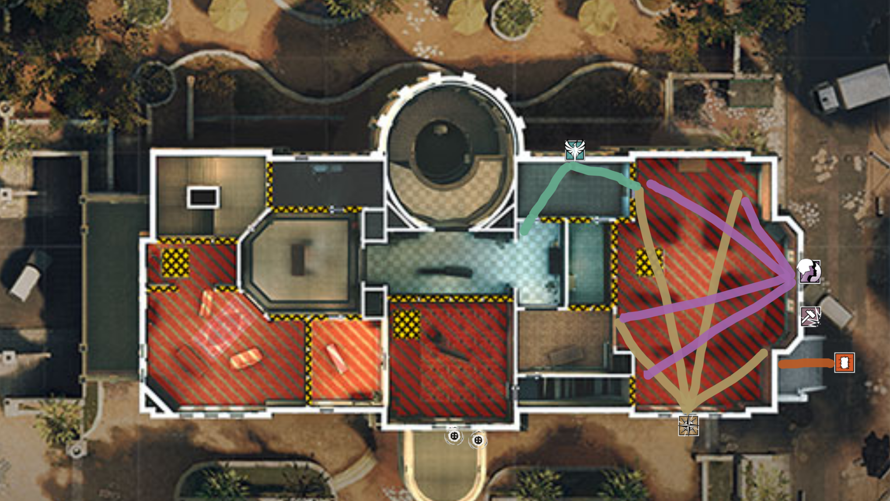
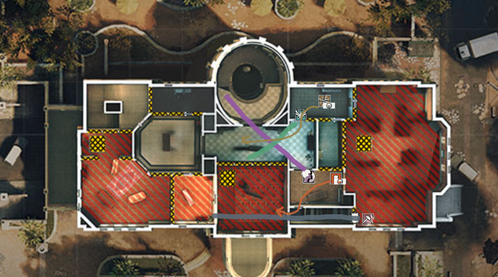
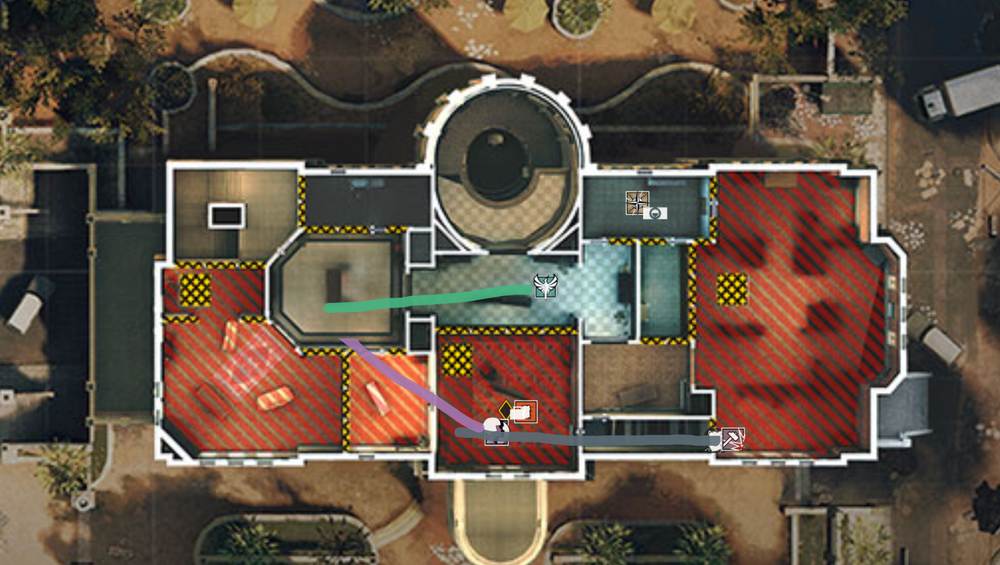

# Consulate

[Callouts](#callouts)\
[Attack Strategies](#attack-strategies)\
[Defense Strategies](#defense-strategies)

## Callouts

### Basement

### First Floor

### Second Floor

## Attack Strategies

Abner: Iana\
Riek: Zofia\
Ryan: Sledge/Buck\
Sora: Nomad\
Ted: Thermite

**Strategies**:

[CEO/Meeting - Admin Take](#admin-take)\
[CEO/Meeting - Yellow Take](#yellow-take)\
[Garage/Kitchen - Piano Take](#piano-take)

### CEO/Meeting

#### Admin Take

Objective: Meeting plant\
Attack type: 5-0 unified\
Method: 1 side overload

##### Step 1: Take Admin

Objective: Clear admin through a 2-way crossfire and escape coverage.

Iana: Rappel admin windows. Attempt to clear admin from rappel.\
Zofia: Rappel copy window. Cut off copy escape route from admin. Prevent any others from entering through copy.\
Sledge: Drone for Iana/Nomad.\
Nomad: Airjab meeting balcony and lobby door. Pinch admin with Iana.\
Thermite: Cover visa double door for runouts.

#### Step 2: Control Half of Top Floor

Objective: Secure admin, office, and copy.

Iana: Enter admin window. Push through office. Lock down top spiral.\
Zofia: Enter copy. Hold a shallow angle on long desk.\
Sledge: Enter admin window. If admin wall soft, breach. Hold meeting door from office or admin wall.\
Nomad: Enter admin side window. Move to copy. Switch to support for Zofia. Drone long hall.\
Thermite: Enter admin window. If admin wall hard, breach. Switch to support for Iana and Sledge. Prepare for meeting plant. Drone meeting.

#### Step 3: Plant Meeting

Objective: Deliver Thermite to meeting and plant safely.

Iana: Enter meeting off of Thermite's drone. Go for trades. Play to die. Attempt to clear connector.\
Zofia: Swing long hall. Flush long desk and potential meeting/long desk rotate. Play off Nomad's drone.\
Sledge: Continue to hold admin wall breach. If necessary, push up to meeting door to support Thermite for plant.\
Nomad: Active drone for entry. Pay particular attention to connector.\
Thermite: Follow Iana. Smoke and plant meeting.

#### Step 4: Post Plant

Objective: Defend planted defuser

Iana: If still alive, rappel meeting window. Wait for audio cue to swing defuser.\
Zofia: If still alive, retreat to vending. Hold angle down long hall.\
Sledge: Continue to hold admin wall breach. If necessary, push up to meeting door to support Thermite.\
Nomad: If Zofia dead, hold Zofia's angle. Otherwise, find a hole in coverage to fill.\
Thermite: Retreat to office. Wait for audio cue to swing meeting. Beware of bottom visa stairs.

## Defense Strategies
