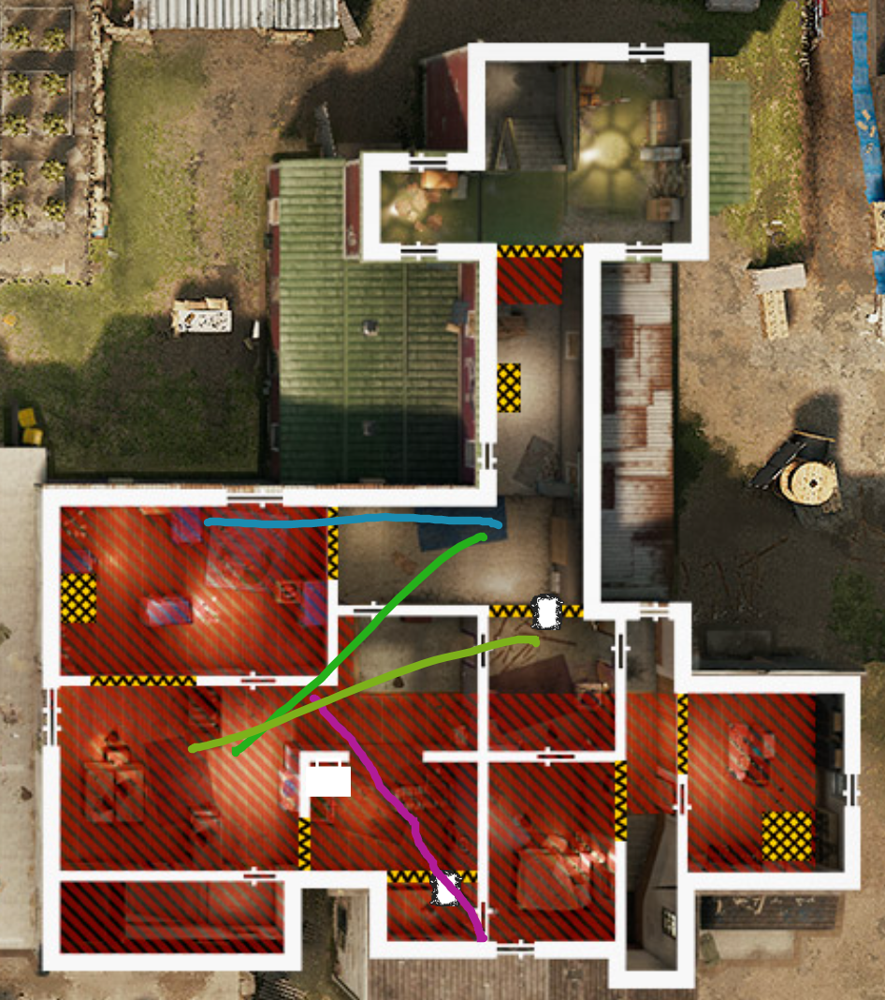
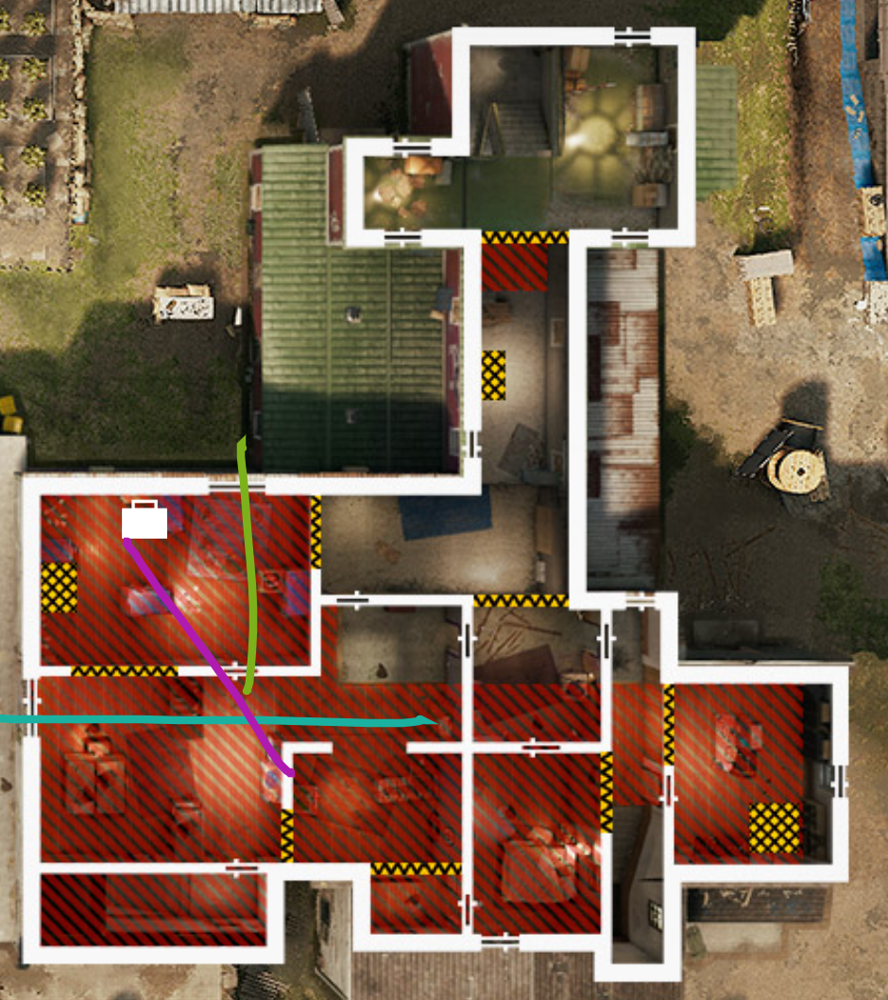
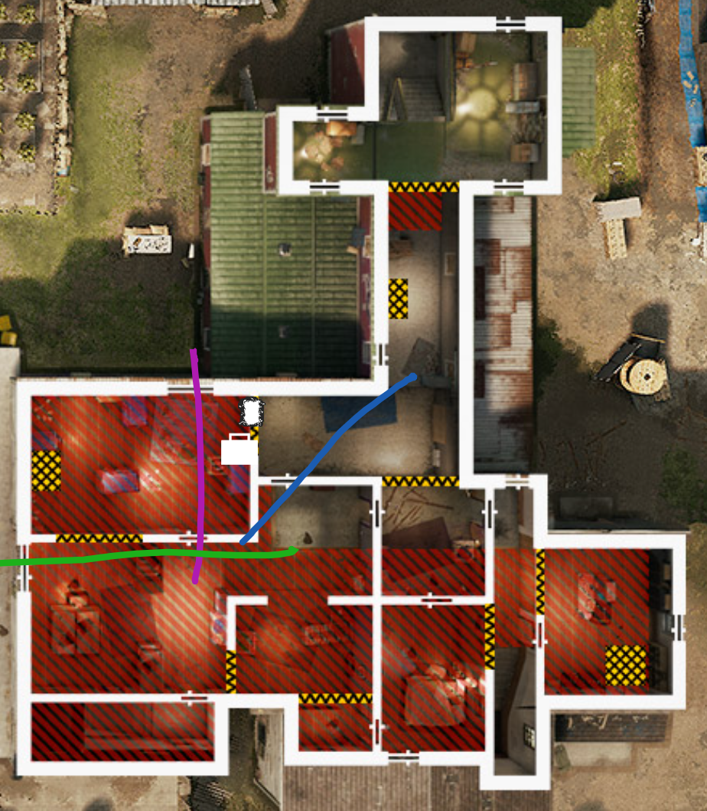
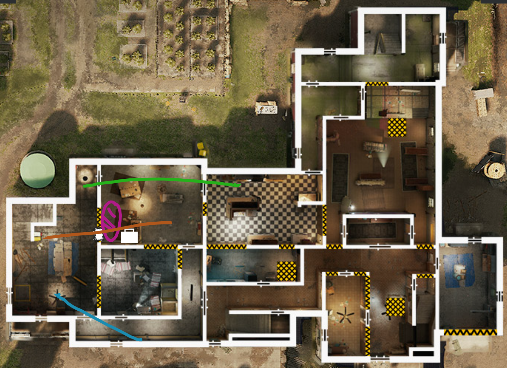
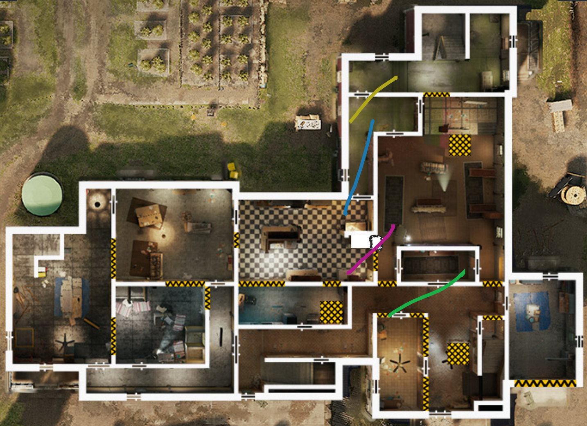
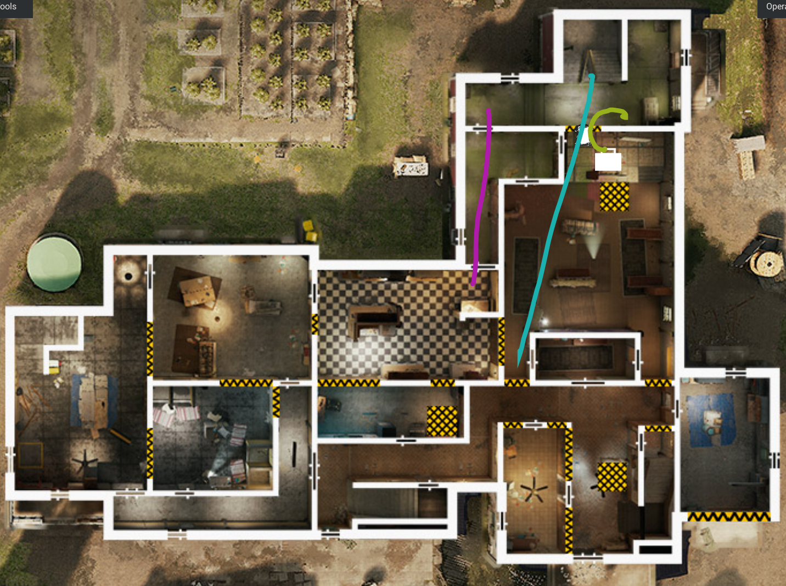

# Oregon

[Callouts](#callouts)\
[Attack Strategies](#attack-strategies)\
[Defense Strategies](#defense-strategies)

## Callouts

### Basement

### First Floor

### Second Floor

## Attack Strategies

**Strategies**

[Kids/Games - Games Take](#games-take)\
[Kids/Games - Bunks Take](#bunks-take)\
[Kids/Games - Kids Take](#kids-take)\
[Kitchen/Dining - Dining Take](#dining-take)\
[Kitchen/Dining - Meeting-Kitchen Take](#meeting-kitchen-take)\
[Meeting/Kitchen - Meeting-Take](#meeting-take)

### Kids/Games

#### Games Take

#### Bunks Take

#### Kids Take

### Kitchen/Dining

#### Dining Take

Thermite can counter electric from vert

#### Meeting-Kitchen Take

Watch for flank from meeting hatch

### Meeting/Kitchen

#### Meeting Take

Think of this like Throne on Theme Park. **Must clear vert before planting**

